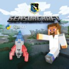

README
******

       
.. image:: https://readthedocs.org/projects/sensorcraft/badge/?version=latest
	:target: http://sensorcraft.readthedocs.io/en/latest/?badge=latest
	:alt: Latest Documentation Status
	
.. image:: https://readthedocs.org/projects/sensorcraft/badge/?version=stable
	:target: http://sensorcraft.readthedocs.io/en/stable/?badge=stable
	:alt: Stable Documentation Status

`Introduction YouTube video <https://youtu.be/nZWZNGVQwbM>`_ is now available!
Open source tools and code to teach 5th – 12th graders Python Programming 
within a Minecraft environment. Most people are familiar with 
`Minecraft <https://minecraft.net/en-us/>`_ (Minecraft is developed by Mojang 
and not related to this project nor do they endorse this project). For this
project, we are using a “World of Blocks” environment created in the Python 
programming language that will allow children to explore simulations in order
to conduct their own scientific experiments within the world of code. 

Kids can change gravity, learn how to build structures programmatically, and 
even launch a rocket.  `The Air Force Research Laboratory (AFRL) 
<http://www.wpafb.af.mil/AFRL/>`_ Sensors Directorate located in Dayton, Ohio
created this project to inspire kids of all ages to learn to program, and, at 
the same time get an idea of what it is like to be a Scientist or Engineer for 
the United States Air Force.

To get started download the `latest release zip file
<https://github.com/rovitotv/SensorCraft/releases/latest>`_  and unzip, then
open the file "index.html" file in your browser.

A `YouTube video has been created <https://youtu.be/C9n1bS54AIw>`_ to show 
students how to install SensorCraft and Enthought Canopy then run the examples.  
The video is for Mac OS X but the process for Windows and Linux is similar.  
**SensorCraft supports both Python 2.7 and Python 3.x, make sure you install a 
version of Enthought Canopy that supports Python 2.7 or Python 3.x.**

--------------------------------------------------------------------------------------------------------------------------------------

Getting Started 
===============

To help you get started creating your own Sensor Craft experience, we've created
a series of tutorials to walk you through each step. Each tutorial will take 
approximately 15 - 20 minutes to complete and will help you understand the 
Python programming language. 

Below you can find a link to each tutorial and a short description of what 
topic you will be learning in each one. Each tutorial builds on the previous
tutorial but they are designed ot stand on their own so feel free to skip 
around. However, we do recommend starting out with the introduction tutorial 
so that you will have all of the needed software installed. 

**Thank you for using Sensor Craft.** 

- `Introduction <guide/intro.html>`__
	- This tutorial goes through how to install Enthought Canopy, the editor we will be using to | view, modify, and run our SensorCraft code. After installing Enthought Canopy, the tutorial walks you through how to install the needed packages to be able to use Sensor Craft. 

- `Building a Flat World <guide/00_flat_world.html>`__
	- This tutorial goes through how to create your world and make sure it has only a flat 2-tall layer of blocks on the bottom and a block fence around the perimeter of the world. Also, this tutorial goes through how to move your character about inside of your world. 

- `Building Automatically <guide/01_building_automatically.html>`__
	- This three-part tutorial starts out by discussing the role that programming plays in our everyday lives. In part 1, you learn how to create a function to build a wall automatically. In part 2, you learn how to change the parameters of the wall from part 1. In part 3, you learn how to automatically build a pyramid using a similar method as part 1 and 2. 

- `Creating a 3D Coordinate System <guide/02_3D_coordinate_system.html>`__
	- This tutorial starts out by talking about mathematics in programming and then introduces the idea of a coordinate system in the game and how to use different blocks to create one. 

- `Displaying the Current Selected Block <guide/03_show_current_block.html>`__
	- This tutorial teaches you how to change the Graphical User Interface, to make it so you can view which type of block is currently seleted by your character. 

- `Altering Gravity <guide/04_play_with_gravity.html>`__
	- This turial walks you through how to alter the outside forces acting upon your character, specifically gravity. In this tutorial, you will learn how to change the gravity of the world and speed of your character. 

- `Saving Your World <guide/05_pickling_the_world.html>`__
	- This tutorial teaches you how to save your world, or pickle is, so that you don't have to restart your world every time that you play. Also in this tutorial, you'll learn some more aspects of Python that will help you later on in the tutorials.
	  
- `Opening Your saved world <guide/06_reading_the_pickled_world.html>`__
	- This tutorial teaches you how to load the saved world that you created in the last tutorial. We recommend doing the "saving Your World" tutorial before this one so that you have a saved world to open. 

- `Launching a Rocket <guide/07_rocket_launch.html>`__
	- This three-part tutorial, as it may seem, teaches you how to construct a rocket through your code and have it appear in your world. Part 1 shows you how to use keyboard functions to launch the rocket.Then, part 2 shows you how to use a timing system to launch the rocket. Finally, Part 3 shows you how your character can actually go for a ride on the rocket.  

- `Building the National Museum of the United States Air Force <guide/08_making_nmusaf.html>`__
	- This tutorial teaches you how to replicate the National Museum of the United States Air Force and load it into your world using the Saving Your World and Opening Your Saved World tutorials. 

- `Creating Mobs <guide/09_mob.html>`__
	- This two-part tutorial teaces you how to create other 'living' creatures in your game. Part 1 teaches you how to use keyboard functions to add or remove mobs into your game. Part 2 teaches you how make the mob move on their own during gameplay. 

- `Creating a Health Bar <guide/10_health.html>`__
	- This four-part tutorial teaches you how to create an in-game healthbar to track the life left in your player. Part 1 teaches you how to display the health bar. Next, part 2 teaches you how to change the amount of health your player has. Then, part 3 teaches you how to end the game after you run out of health. Finally, part 4 teaches you how to enable mobs to damage your health.  

- `Introducing Artificial Intelligence <guide/11_AI.html>`__
	- We recommend that you complete the 'Creating Mobs' tutorial as a prerequisite to this one. This two-part tutorial teaches you how to add logic and decision making into the minds of the mobs from the 'Creating Mobs' tutorial. Part 1 shows you how to install and use a new class, an important aspect of programming. Part 2 teaches you how to add certain constraints to the actions of your intelligent mobs. 

- `Creating a Map <guide/12_map.html>`__
	- This three-part tutorial teaches you how to create a map icon and track different live items in the game.First, part 1 teaches you how to display a map icon into the gameplay window. Then, part 2 teaches you how to constantly track your location on the map. Finally, part 3 teaches you how to track the location of other live items on the map. 

- `Conclusion <guide/conclusion.html>`__
	- This tutorial points you in the directions of many useful programing resources and sums up our intentions for creating SensorCraft. 

- `Frequently Asked Questions <guide/frequently_asked_questions.html>`__
	- We try to address common problems and questions in their corresponding tutorials but if you cannot find the answer in the specific tutorial, try searching in this document. 
	  
--------------------------------------------------------------------------------------------------------------------------------------

GitHub Release
==============

.. `v1.9 Thanks to @Fladam for a MOB Chapter and Python 3 support <https://github.com/rovitotv/SensorCraft/releases/download/v1.9/SensorCraftV1.9.zip>`_

`v1.8 Thanks to @Fladam Dr. Steve can now ride the rocket, updated Enthought install directions to reflect new version, and added a FAQ <https://github.com/rovitotv/SensorCraft/releases/download/v1.8/SensorCraftV1.8.zip>`_

`v1.7.1 Changed gravity and jump height back to default <https://github.com/rovitotv/SensorCraft/releases/download/v1.7.1/SensorCraftV1.7.1.zip>`_

`v1.7 Crushed bugs and added a new chapter on creating the NMUSAF <https://github.com/rovitotv/SensorCraft/releases/download/v1.7/SensorCraftV1.7.zip>`_

`v1.6 Much improved install and run directions <https://github.com/rovitotv/SensorCraft/releases/download/v1.6/SensorCraftV1.6.zip>`_

`v1.5  Directory consolidation <https://github.com/rovitotv/SensorCraft/releases/download/v1.5/SensorCraftV1.5.zip>`_

`v1.4 Rocket Launch <https://github.com/rovitotv/SensorCraft/releases/download/v1.4/SensorCraftV1.4.zip>`_

`v1.3 Mores Updates to README <https://github.com/rovitotv/SensorCraft/releases/download/v1.3/SensorCraftV1.3.zip>`_

`v1.2 Update to README <https://github.com/rovitotv/SensorCraft/releases/download/v1.2/SensorCraftV1.2.zip>`_

`v1.1 First CD release <https://github.com/rovitotv/SensorCraft/releases/download/v1.1/SensorCraftV1.1.zip>`_

The latest version will always be on the `github project site 
<https://github.com/rovitotv/SensorCraft>`_.

--------------------------------------------------------------------------------------------------------------------------------------

CD Release
==========

For STEM events we have created a CD from this content, to begin with the CD open index.html

Last commit before March 3rd, 2016 demonstration for My Brother's Keeper STEM 
Event

Overview of the products in this directory for the CD release:

* HTML web version that can be open in web browser is in _build/html/index.html
* PDFs of the web pages are in PDFs/
* code includes python code for the different exercises
* images the images that appear in the PDFs and HTML
* OriginalFoglemanCode the code started 
* SensorCraftLogo is a directory with the CD cover and RYA generated art work
* EnthoughtCanopy directory contains Windows and Mac versions of Enthought Canopy Express, please check the Enthought web site for the latest version

The CD doesn't have the rocket launch chapter so consider updating from the
latest github release.

--------------------------------------------------------------------------------------------------------------------------------------

Logos and Third Party Materials
===============================

Python
------

Python is an open source programming language and it's logo is meant to be
used on Python derived products see https://www.python.org/community/logos/

We believe this product conforms to the Python Software Foundation's 
policy. 

Minecraft by Mojang
-------------------

Mojang the creators of Minecraft are liberal with their IP:
https://account.mojang.com/documents/brand_guidelines

We believe this product conforms to Mojang's guidelines.

Enthought Canopy Express
------------------------

Included on the CD is Enthought Canopy Express which is a Python distribution
that includes Python plus pyglet that performs the OpenGL work.  In addition
Enthought Canopy Express includes an excellent editor that will make it easier
to work with the code.  Enthought offers an academic product that is free for
students and teachers, more `details are provided at Enthought's web site
<https://store.enthought.com/#canopy-academic>`_

Question 10 of `Enthought's Canopy FAQ
<https://www.enthought.com/products/canopy/faq/>`_ grants us permission to
redistribute Enthought Canopy Express and can include it on CDs or DVDs.

--------------------------------------------------------------------------------------------------------------------------------------

Miscellaneous
=============

This project is done with restructured text which is Python's default for
documentation it creates html pages.  

References to Sphinx documentation:
https://pythonhosted.org/an_example_pypi_project/sphinx.html

Steps to build and make release
-------------------------------

Assume the version we are going to release is 1.5 and will reside in
~/temp/SensorCraftV1.5. The makefile within the project will build the html
files with this command::

	cd /Volumes/SecureCode/SensorCraft/guide
	make clean && make html
	mkdir ~/temp/SensorCraftV1.5
	cd _build/html
	cp -av * ~/temp/SensorCraftV1.5
	cp ~/temp/SensorCraftV1.5/index.html ~/temp/SensorCraftV1.5/START_HERE.html
	cd ../../..
	cp -av code ~/temp/SensorCraftV1.5/
	cd ~/temp
	zip -r SensorCraftV1.5.zip SensorCraftV1.5
	cd /Volumes/SecureCode/SensorCraft

Makes changes to the README.rst to reflect a new release, then perform the
following commands::

	git commit -a
	git tag -a v1.5 -m "version 1.5 - Directory consolidation"
	git push
	git push --tags

Dependencies
------------

pyglet for OpenGL support and sphinx to build the documentation

How to get release download count from GitHub
---------------------------------------------

GitHub has a RESTFul API so use the CURL commands::
	
	curl -i https://api.github.com/repos/rovitotv/SensorCraft/releases &> ~/temp/GHSensorCraftRelease.txt
	cat ~/temp/GHSensorCraftRelease.txt | grep 'download_count'

How to create a PyPi package
----------------------------

First, rename the "code" directory to "sensorcraft" to specify the name of the
package. Move the images directory into the directory that is now named
"sensorcraft." Then, rename the "guide" directory to "docs" to let the package
know that it contains the documentation.

Create a new file in your user's home directory using terminal with the
following commands::

    cd /Users/(your_username)
    mkfile -n 1024 .pypirc
    
In that file, type the following and then save it::

    [distutils]
    index-servers =
        pypi
    
    [pypi]
    username=your_username
    password=your_password
    
Go into terminal and enter the following to install twine which will be used to
upload the package to PyPi::

    pip install twine
    
Finally, create and upload the package to PyPi with these final commands while
in the directory containing the package directory::

    python setup.py sdist
    twine upload dist/PACKAGENAME-VERSION.tar.gz
    
References for creating a PyPi package:
https://tom-christie.github.io/articles/pypi/
https://packaging.python.org/tutorials/distributing-packages/

To Do List
----------

-Add instructions about IDLE...need something about how to goto a line, how
about IDLE = IDLE3 in some cases
-Test on Windows
-A note about running idle from the code directory so you can open files
easier
-In chapter 12 part 3 the feet on the mob are not moving, need to fix that
