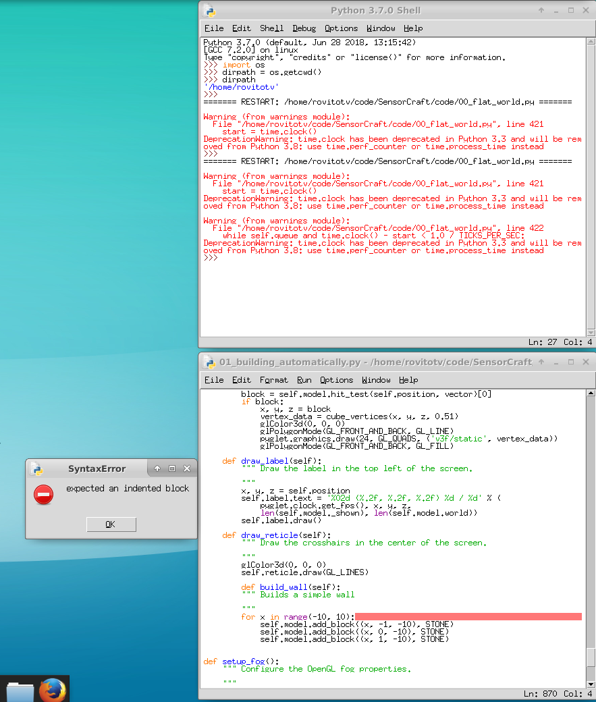
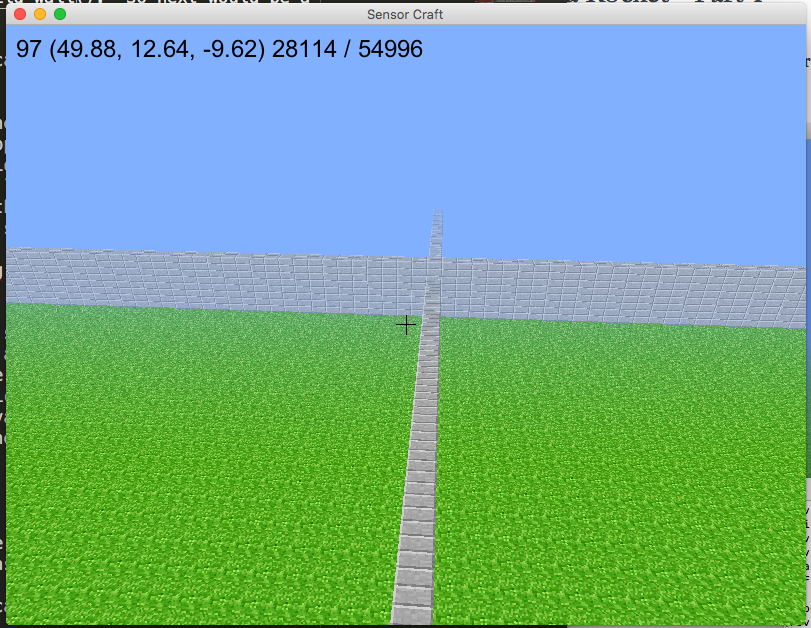
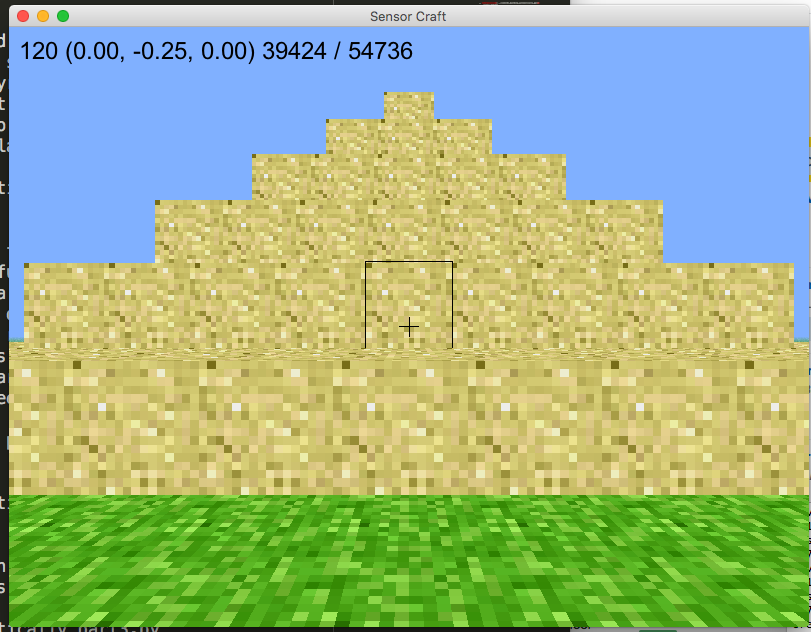

=========================
01 Building Automatically
=========================

Building a Wall Automatically - Part 1
--------------------------------------

For a computer scientist, code runs the world but this is true for the everyday
person on planet Earth even if they do not realize it.  Code is in your
refrigerator, microwave, car, TV, you name it code runs the device.  We live in
a digital age.  

One thing that is not apparent to most people is that when you
have the source code to your device or game you can do almost anything that you
can imagine. Think about your favorite game. Wouldn't it be
cool if you could make your character move faster, have more 
health, or deal more damage? Games are one thing but as a 
Computer Scientist for the Government, having the source code 
makes it possible to verify the system performance and understand 
the weakness or strength of an algorithm.

Fortunately, open source software exists and is thriving today making computer programming
accessible to everyone. For this exercise we are going to use a simple 'for loop'
to build a wall by pushing the ``b`` key.  To get started with this programming
exercise, first copy 00_flat_world_TVR.py code to a new file
01_building_automatically_TVR.py but replace TVR with your initials using the
following command::

	cp 00_flat_world_TVR.py 01_building_automatically_TVR.py

The first thing we have to do is tell the program that the ``b`` key is worth
listening to; so, jump down to line 742 and make the adjustments as shown
below:

.. literalinclude:: ../code/01_building_automatically.py
	:pyobject: Window.on_key_press

Take note that the method we are working on is called "on_key_press" which is a name
that makes a lot of sense because this code will be executed when a key is
pressed.  Lots of keys exist on the keyboard and for this game; however, we only care
about the keys listed so we use an if-else statement to execute lines of code
when that particular key is pressed.  The code is obvious when symbol is  equal
to the constant key ``b`` then execute the method ``build_wall()``.  So next would be a
good time to create the build_wall method.

.. literalinclude:: ../code/01_building_automatically.py
	:pyobject: Window.build_wall

The build_wall method is created at the end of the Window class on line 857, be
sure to tab this method over two tabs or Python will be unhappy.  Python uses
whitespace (in our case the tab character) to delimit program blocks, which is
a genius feature of Python because you don't have to count braces like in many
other languages. One of the key advantages of using IDLE is if the tabs are not
correct it will highlight the error with a red underline as shown below:

A "for loop" is a critical structure in computer science and is often used by
programmers to repeat instructions over and over again and  increment (or
decrement) a variable.  In this case the variable is x and it will run over the
range starting at -10 and ending before 10.  Notice that for each iteration of
the for loop a block is added at a different elevation -1, 0, or 1.  We will
explain 3-dimensional coordinate systems in the next chapter.

Building a Great Wall Automatically - Part 2
--------------------------------------------

By changing a single variable in the for loop, the wall can be turned into a 
great wall. Simply change the build_wall method as follows:

.. literalinclude:: ../code/01_building_automatically_part2.py
	:pyobject: Window.build_wall 

Notice that the x variable in the for loop now goes from -100 to 100, and the 
wall goes past the boundaries of the world.  Below is a picture of what
the wall should look like in the great wall form.

Building a Pyramid Automatically - Part 3
-----------------------------------------

Pyramids can be a challenging structure to build in a block based game because
of all the repetition. Pyramids are essentially smaller and smaller squares
laid on-top of each other.  Before we build a pyramid, let's make it easier to
construct solid shapes by creating a method that takes two x, y, z points as
parameters, then adds blocks in between those two points.  Lets call this new
method ``add_blocks()``, and place it in the model class on line 255.

 .. literalinclude:: ../code/01_building_automatically_part3.py
	:pyobject: Model.add_blocks

The ``add_blocks()`` method is complicated, so don't feel bad if you don't 
understand all of it. Python 'for loops' uses the range function which doesn't include
the last number in the range so we have to add a +1 to the end of every range.
To make sure the ranges increment in the proper direction, we check the 
arguments to determine the start of each of the ranges for x, y, and z.  Finally,
we use three for loops to fill in all the blocks similar to what we have done
in previous chapters. It is reasonable not to care how the ``add_blocks()``
method works and just use the method when you need to use it.  

We changed the key from ``b`` to ``p`` in the ``on_key_press`` method to build
the pyramid automatically as listed in the code below:

 .. literalinclude:: ../code/01_building_automatically_part3.py
	:pyobject: Window.on_key_press

Next, we removed the method ``build_wall()`` and then created a new method called
``build_pyramid()`` on line 899.  The ``build_pyramid()`` methods is shown below:

 .. literalinclude:: ../code/01_building_automatically_part3.py
	:pyobject: Window.build_pyramid

Basically, the ``build_pyramid()`` method lays a square that has a width of -1 for
every layer it creates.  The ``add_blocks()`` method is employed to make the
``build_pyramid()`` method simpler. Now, when the user presses the ``p`` key, the
following result should be shown:

Note, the pyramid will not be placed where the reticle on your screen is 
pointing. It will be constructed at the x, y, and z coordinates placed
under the ``build_pyramid`` function as defined at the top of the function by
the variables posx, posy, and posz.