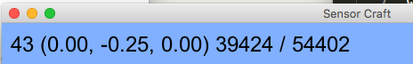
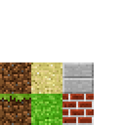
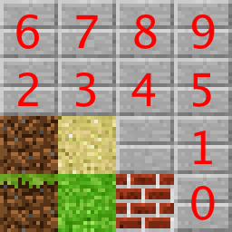

=======================
02 3D Coordinate System
=======================

Math is everywhere in Computer Science, but not the kind of math most young
kids learn in school.  When you first start learning mathematics you start
with arithmetic which, can be tedious, but, is necessary to build a strong
foundation for which to do more complex mathematical operations. The good
thing about programming computers is that the computer can do almost all the 
calculations for you, so no need to do arithmetic! 

However, you still need to have a good understanding of higher level 
mathematics depending on the types of applications you are programming. Some
of the math in video games can get complex so we will take it slow over the 
next few chapters.  Since this tutorial is a block based game some of the math
is simplified because everything is a cube. We created this `YouTube video 
about this chapter 02 3D Coordinate System. <https://youtu.be/WesDR-w3_Ko>`_.

Coordinate System Display
-------------------------

Take note of the text in the upper left of the game window of SensorCraft, 
what are all those numbers?  

The first number starting from the left is frames per second, which is a good
indicator of how well the game is  performing. Most humans need to see 20 - 25
frames per second to consider a video "smooth".  Videos are just a series of 
images, so when the image is not updated often enough the video appears to be
jerky.  Thus higher frame rates allow for "smooth" video.  Frame rates can slow
down if the code is too complex or too many blocks have to be rendered
simultaneously. The next three numbers in parenthesis "()" are the X, Y, Z
coordinates of your character, which denote the location of your character 
within the game space. Take note that if you start the game then walk in a 
straight line the X or Z will increase.  Y increases when you jump by pushing 
the space bar.  Any one of these axes by itself is just like a number
line, the only difference is here you have 3 number lines. The third set 
of numbers is the ratio of blocks loaded around you to total blocks in the 
entire world.   

Getting Started
---------------

To get started with this programming exercise first copy the file
01_building_automatically_TVR.py to a new file 02_3D_coordinate_system_TVR.py but replace TVR with your initials using the following command::

	cp 01_building_automatically_TVR.py 02_3D_coordinate_system_TVR.py

This command will create a new file with all the traits of the last exercise
being the world is flat and pressing the ``b`` key for the construction 
of a wall.

SensorCraft and other games use a system called OpenGL, which stands for Open
Graphics Language. This system draws geometric primitives in 3D very fast. 
Obviously, a game such as SensorCraft uses many cubes, but how does each block
type get created? First, OpenGL renders (aka displays) a cube; then, it will 
wrap "textures" around the cube.  This is similar to wrapping a present in real
life. OpenGL will take a 2 dimensional image and wrap it around the cube.  
Textures are generally stored in a simple image file.  So far we have been 
using a file called "texture.png". If you open up texture.png with a image 
viewing program you will see this:

Textures
--------

The "texture.png" file originated from github when we cloned the repository, and
designed SensorCraft.  It has the basic textures that we need in a coordinate 
system where points or locations are denoted as (x,y).  (0,0) denotes the 
bottom left corner.  As you increase x, you will examine textures farther to
the right.  As y increases you will move upward in the textures.

Let's consider how we would make a block with grass on top and brown everywhere
else.  From the side, we want to see a brown block with some green at the top 
where the grass is.  This is denoted by the texture at coordinates (0, 0) in
this file.  When we look at this block from above, we just want to see the 
grass which is the texture at coordinate (1, 0).  Finally if we were below this
block, we would just see the brown dirt, which is located at coordinate (0, 1).

Take note that for the sand block no matter if it is top, side, or bottom will
always look the same and be represented by the texture at coordinates (1,1).

For this programming exercise, we want to use numbered blocks. To do this, we
generated a new texture file called "numbered_textures.png" that looks like the
following:

In order to use the new "numbered_textures.png" file you want to change
line 76 to read as follows::

	TEXTURE_PATH = 'numbered_textures.png'

Generally, a path tells the program where to look for a file or program.  
For example, if you type "pwd" into the console, it will print the 
path to your current place in the file system. It should look something 
like ``/home/user_name/Documents/SensorCraft/code``.  It's the textual 
equivalent to the folders you have to click on to get to a saved file. In 
our case, we need to tell the program where to find the textures we want 
to use so we provide the file name.

After changing the TEXTURE_PATH variable, we want to add new block types for
each of the numbered stone blocks. Starting at line 78, append (add) the following
codes:

.. literalinclude:: ../code/02_3D_coordinate_system.py
	:lines: 78-92

To make sure you don't create a typo, simply copy and paste the code from the
web browser to your editor.

What this code does is specify the different types of blocks.  We had 
already been using the first four blocks: ``GRASS``, ``SAND``, ``BRICK``, and ``STONE``.  
For each block, we use the coordinates to define the top, bottom, and side 
textures in that order.  We then added ``NUMSTONE``, a list of blocks of the 
various numbers.  When we call append, we are adding a new set of 
coordinates to define a numbered block to the list. Now for an integer 
(let's call it "n") between 0 and 6 you can just call ``NUMSTONE[n]`` to 
reference the block displaying number n.

Numbered Blocks in 2D
---------------------

Next we are going to adjust the ``_initialize`` function like we did in the previous
programming exercise to create a number line on the x and z axes.  The location 
that the player starts to be treated as the origin (0,0) and we want to number
to the sides and in-front and behind the player's location.  Here is what the 
initialize function should look like when you are done:

.. literalinclude:: ../code/02_3D_coordinate_system.py
	:pyobject: Model._initialize

We are cleverly using a for loop and placing four blocks at a time: by using a
negative sign we can go in both positive and negative directions 
simultaneously.  Now run the new game in IDLE by opening your new file and
pushing the ``F5`` key in the editor window.

Make your character look down and take note you are standing on a 0 block. Now
move forward and watch the upper left corner and pay attention to what the
display says while comparing it to the number line. Make sure you move across
both number lines while looking down.

What about 3D?
--------------

This is fun but it is only a two dimensional system and obviously we are 
playing in a three dimensional world. Think about how you would modify the
initialize method again to place number blocks on the y axis so we have three
number lines that will represent our 3D world.  The solution is below:

.. literalinclude:: ../code/02_3D_coordinate_system_part2.py
	:pyobject: Model._initialize