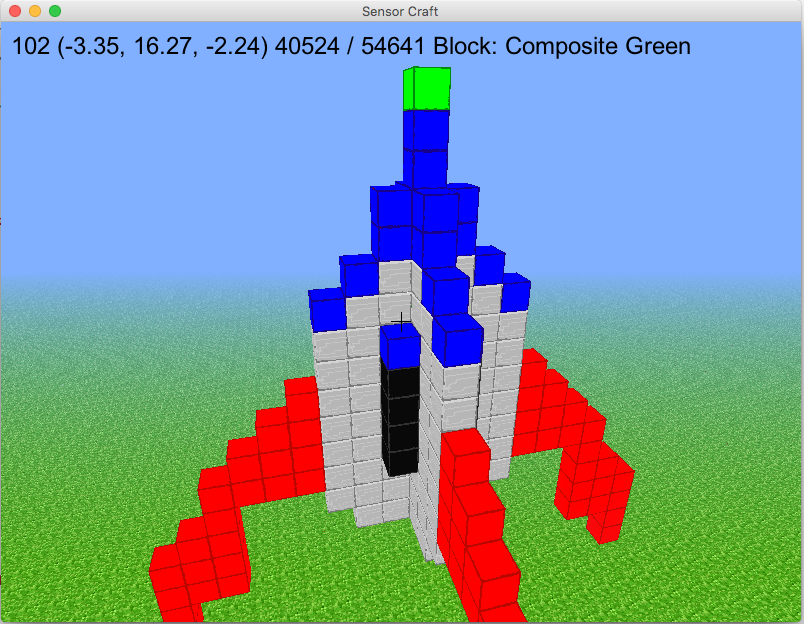

================
07 Rocket Launch
================

Using the Keyboard to Launch a Rocket - Part 1
----------------------------------------------

Now that you can save and load worlds that are made out of the new high tech
composite blocks, let's put those skills to use to launch a rocket!
Rockets are amazing machines that the USAF uses to lift satellites to orbit. 

For this exercise we will use the previous exercise
`06 Loading the World <06_loading_the_world.html>`__ to create a rocket similar
to the rocket on the cover art for SensorCraft.  You can either use only the
composite blocks and the previous exercise
`06 Loading the World <06_loading_the_world.html>`__ to build a rocket of your
own design or you can use the supplied text file called "rocket.txt" in the 
code directory.

To get started with this programming exercise first copy the file 
06_reading_the_saved_world.py python code to a new file 07_rocket_launch_TVR.py
(again replacing TVR with your initials) using the following command::

    cp 06_reading_the_saved_world.py 07_rocket_launch_TVR.py

If you are going to use the provided rocket in "rocket.txt," you need to change 
the file loaded in the ``load_txt`` function.  If you want to load this file, 
change the line that reads ``with open('composite_world.txt', 'r') as file:`` 
to say ``with open('rocket.txt', 'r') as file:`` so now when you load from a 
file, it will look for the file called "rocket.txt". The code should look as
shown below:

.. literalinclude:: ../code/07_rocket_launch.py
	:pyobject: Model.load_txt

Now we need to create a new variable within the "Model" class that helps the
class keep track of whether the rocket has been loaded or not.  This will
prevent a player from loading a rocket multiple times.  Jump down to line
167 (the end of the Model ``__init__`` function before the line 
``self._initialize()``) in the new file and add the code shown below:

.. literalinclude:: ../code/07_rocket_launch.py
	:lines: 165-167

Next jump down to line 463 (just after ``load_txt``) and create a new method 
called "move_rocket_up" which will move the rocket up one block.  The new 
"move_rocket_up" method is shown below:

.. literalinclude:: ../code/07_rocket_launch.py
	:pyobject: Model.move_rocket_up

Let's walk through this function a little more closely. First, we create a new
dictionary ``composite_world``. This will be used to store the location and 
type of all composite blocks, that is it will store all the blocks that make
up the rocket.

Next is the first for loop. We need to go through every block in the world and
identify and save all composite blocks into ``composite_world``. Notice in the
for loop there are two variables: ``world_key`` and ``world_value``. Our world 
dictionary is stored so that the keys are the location of the block in the form
``(x, y, z)`` and the value is the type of block. So what we want to do is see 
if ``world_value`` is one of our composite blocks. 

When we find a composite block, we store it's location and type into 
``composite_world`` with ``composite_world[world_key] = world_value`` and then
remove the block with ``self.remove_block(world_key, True)``.

Now we need to go back and add every block back, but moved one block up. So, we
go through ``composite_world`` just as we did before, but now we update the y
component of the key with ``new_y = composite_key[1] + 1``. Python uses zero
indexing so if we want to access the second element ``y`` of ``(x, y, z)`` we 
have to use ``composite_key[1]``. Finally we can actually add the block back
with a call to ``add_block``.

We also need the rocket to come back down to land.  At line 491 after 
``move_rocket_up`` add a new method called ``move_rocket_down`` which will move
the rocket down one block.  The new ``move_rocket_down`` method is shown below:

.. literalinclude:: ../code/07_rocket_launch.py
	:pyobject: Model.move_rocket_down

Notice ``move_rocket_up`` and ``move_rocket_down`` are almost 
identical, the only difference being that to move the rocket up 
we increase the y component whereas to move it down we decrease it.

Next we need to make sure the position and rotation of Dr. Steve is correct
so when the rocket appears we will be looking at the rocket and not somewhere
else.  Feel free to adjust these numbers as you see fit: the rotation and
position variable that we use in this guide are just suggestions.  A little
experimentation goes a long way when setting position and rotation variables.
On lines 539 - 549 of the Window constructor in the method called __init__
change the ``self.position`` and ``self.rotation`` variables as shown below:

.. literalinclude:: ../code/07_rocket_launch.py
	:lines: 539-549

The last thing we need to do is modify the familiar method "on_key_press" so
when the "I" key is pressed the "move_rocket_up" method is called and when the
"K" key is pressed the "move_rocket_down" method is called.  The new 
"on_key_press" method is given below:

.. literalinclude:: ../code/07_rocket_launch.py
	:pyobject: Window.on_key_press

Notice that the new methods "move_rocket_up" and "move_rocket_down" are both
in the class called "Model".  This is expected because manipulating blocks is
done by changing the world data dictionary and it is located within the 
model class.

Test the rocket!  Try launching it.  It is fun to use the "K" key to make the
rocket go beneath the ground.  

Using the Computer Clock to Launch a Rocket - Part 2
----------------------------------------------------

Part 1 used the "L" key and the "K" key to make the rocket go up and down.
While this is a good start it is not very realistic.  In part 2 we are going
to make the rocket go up and down based on the SensorCraft update loop and
your computer's built in clock.

In programming a common approach is to take a complicated problem and break it
down into much smaller pieces, then solve each of those pieces individually.
A common phrase is "How do you eat an elephant? One bite at a time". We started 
by making the rocket move, now we're going to make it move on its own.

First the model class needs several new variables added to the code so move
down to line 164 and replace the code we just changed here with the following:

.. literalinclude:: ../code/07_rocket_launch_part2.py
	:lines: 164-180

One of the new variables we added was rocket altitude. This is simply a number
of blocks where an altitude of zero represents the starting point.  Recall for 
our coordinate system in SensorCraft "Y" represents height above the ground. 
Next on line 476 you want to add a line that will increase the altitude one
block every time the method "move_rocket_up" is called. The definition of 
``move_rocket_up`` should now be the following:

.. literalinclude:: ../code/07_rocket_launch_part2.py
	:pyobject: Model.move_rocket_up

We should make the same change for the corresponding function 
``move_rocket_down`` which will decrease the altitude by one block every time
the method is called:

.. literalinclude:: ../code/07_rocket_launch_part2.py
	:pyobject: Model.move_rocket_down

Let's add two methods at the end of the model class after ``move_rocket_down``:

.. literalinclude:: ../code/07_rocket_launch_part2.py
	:pyobject: Model.launch_rocket

.. literalinclude:: ../code/07_rocket_launch_part2.py
	:pyobject: Model.process_rocket

The method "launch_rocket" is simple: it checks to make sure the rocket
is loaded, meaning the user pressed the "L" key, and the rocket is not
launched.  If both of those conditions are met then ``rocket_launched`` is set
to true and the ``rocket_mode`` is set to "up".

The method "process_rocket" is more complicated but still easy to understand.
First it checks for three conditions: ``rocket_loaded``, ``rocket_launched``, 
and ``rocket_update_count`` >= 8.  ``rocket_update_count`` is used to slow down
the updates of the rocket because the update method in the Window class is called
more frequently than we need to update the rocket.  If all three of the previous
conditions are met then the method will call ``move_rocket_up`` or
``move_rocket_down`` based on the ``rocket_mode``.  At the end of the 
``process_rocket`` method it checks to see if the modes need to be changed
depending on the value of ``rocket_altitude``.  

Next we have to update the familiar method ``on_key_press`` to use the
new methods we just created in the model class:

.. literalinclude:: ../code/07_rocket_launch_part2.py
	:pyobject: Window.on_key_press

Finally, we have to modify the update method in the window class.  Since
different speed computers exist, one common technique used in simulations is to
base events on time.  SensorCraft is set to call the update method in the
window class 1.0 / TICKS_PER_SEC or 1/60th of a second in the window class 
``__init__`` method. All we have to do is call the process_rocket method in the 
model class using the code below on line 688 (after the ``get_motion_vector`` 
function):

.. literalinclude:: ../code/07_rocket_launch_part2.py
	 :pyobject: Window.update

Finally, we need to update what happens when the rocket is loaded from the file. 
Go back to the ``load_txt`` function defined previously and change its implementation 
to read as follows:

.. literalinclude:: ../code/07_rocket_launch_part2.py
	:pyobject: Model.load_txt

Now when you run the program, you should be able to press 'L' to load the rocket 
from the file and then press 'I' to launch the rocket.  Watch as it flies away!
To save US tax payers money the rocket will automatically land after it reaches
a altitude greater than or equal to 40.  You can see the code required to make
that work in the ``process_rocket`` method.

Dr. Steve Rides the Rocket - Part 3
-----------------------------------

In part 1 and part 2 of the rocket launch, Dr. Steve was on the ground while 
the rocket was launched. Now we are going to put Dr. Steve on top of the rocket
so that he rides the rocket. First, we are going to add to the update method on 
line 714 (at the end of the ``update`` function of the model class) so that Dr. 
Steve goes up as the rocket goes up. 

.. literalinclude:: ../code/07_rocket_launch_part3.py
	:pyobject: Window.update

The new position is where Dr. Steve will go when the rocket is launched, which
is on top of the rocket. These few lines of code keep Dr. Steve firmly planted
on top of the rocket and prevents Dr. Steve from falling off the rocket. 
Finally, we need to modify the ``on_key_press`` method so that when you press
"I" to launch the rocket, Dr. Steve is put on top of the rocket. The method of 
``on_key_press`` should now read as follows:

.. literalinclude:: ../code/07_rocket_launch_part3.py
	:pyobject: Window.on_key_press