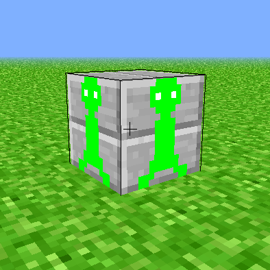

======
09 Mob
======

Using the Keyboard to Move a Mob - Part 1
-----------------------------------------

You might be getting lonely in your world, so now we are going to add a mob into
the game. The mob's texture is already in the code directory for the game, so
all you will have to do is program how it moves.

For this chapter, you will be adding a block into the game that has a mob
texture on it. There will be two states for the mob, one where the "feet" of it
are closer together, and one where they are farther apart. In order to implement
this, you will need to add a block and then set keys to change the state of
the mob and move it. First of all, we will be using the flat world from chapter
0 for this exercise. To do that, you will need to copy 00_flat_world_TVR.py to
09_mob_TVR.py but replace TVR with your initials as done in previous chapters.
To do that, you will need to run this command::

                    cp 00_flat_world_TVR.py 09_mob_TVR.py

First, you will need to change where the program is getting its textures because
there is an added texture for the mob. Do this by changing the "texture.png" to
"mob_textures.png" so that it looks like this:

.. literalinclude:: ../code/09_mob.py
    :lines: 76

Right under this, starting on line 78 in "mob_textures.png", are blocks with 
the texture mappings. Here, we will be adding the two textures for the two 
states that the mob has. In order to do so, add the following under the final
texture mapping that is in the list:

.. literalinclude:: ../code/09_mob.py
        :lines: 78-84

Next, we will be adding the mob into the game. This will be done by telling the
program to listen for the key press ``K`` and ``L``, so go down to line 733 and add
the following key presses:

.. literalinclude:: ../code/09_mob.py
        :pyobject: Window.on_key_press

The program now places a block that acts as the mob at a specific spot in the
flat world with either ``K`` or ``L`` and then the key that was not pressed first
changes the state of the mob. So if you pressed ``L`` at first it will place a
block with the mob texture on it, and then when you press ``K`` the feet of
the mob will move. You can then press ``L`` and ``K`` to move the feet back and
forth between their two stages.

Making the Mob Automated - Part 2
---------------------------------

Now that we have added the texture for the mob into the game, we can automate
the mob so that it can at least move around at the press of a key, and then stop
moving when you press another key. This exercise is similar to moving the rocket
based on time in chapter `7 Rocket Launch <07_rocket_launch.html>`__ because we
will be telling the program to move the mob for a specific amount of updates. 
First, we will need to add some new variables into the model class. On line 160, add these new variables:

.. literalinclude:: ../code/09_mob_part2.py
        :lines: 160-168

After we have added these variables, we can put them to use in a few new
methods that we will create down on line 426. The new methods will tell the
program how to move the mob in four different directions: forward, backward,
left, and right. These methods will call some of the variables that were made
before, such as mob_mode and mob_(x and z)_position. For each direction, we will
make a new method. Starting with moving the mob left, the following are the
processes to move the mob:

.. literalinclude:: ../code/09_mob_part2.py
        :lines: 428-470

Next, we will add a method so that when it is called, it will launch the mob,
as well as a method to stop the mob. These methods will use the variable 
mob_loaded that we added to the program earlier. The method to launch the mob
will load in the initial block with the mob texture, and the method to stop the
mob will adjust the state variables so the mob will stop. Add the following 
lines on line 472, right under the methods we just created to load the mob:

.. literalinclude:: ../code/09_mob_part2.py
        :pyobject: Model.launch_mob

.. literalinclude:: ../code/09_mob_part2.py
        :pyobject: Model.stop_mob

Now we need to add the method for the complete movement of the mob, calling
the four methods for each direction of movement created previously. This will
make it so that the mob can move around with the press of just one button.
Using the mob_update_count variable that we created, we will dictate when the
mob will move in each direction based on how many frames have passed. The
default update count is set to 128 so that the mob moves about every 1.5
seconds. The mob can be made to move faster by making this number smaller, or
slower by making the number larger. Insert the following lines on line 481 to
create this process:

.. literalinclude:: ../code/09_mob_part2.py
        :pyobject: Model.process_mob

Since we have now added an update count in the model class, we have to call that
update in the window class so that it appears on the screen when the program is
executed. Do this by adding process_mob to the update process in the
window class on line 663. The update process should now look similar to this:

.. literalinclude:: ../code/09_mob_part2.py
        :pyobject: Window.update

Finally, the key bindings need to be changed to call the methods that we have
just made. Under the on_key_press method in the window class on line 813, add
two keys, ``K`` and ``L``, then tell them to call the methods we just
created. The final on_key_press method should look close to what is listed
below:

.. literalinclude:: ../code/09_mob_part2.py
        :pyobject: Window.on_key_press

Now, you have an automated mob that moves and stops at the press of a button.