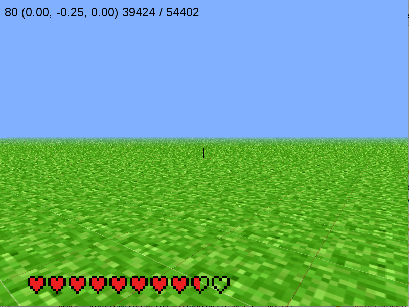
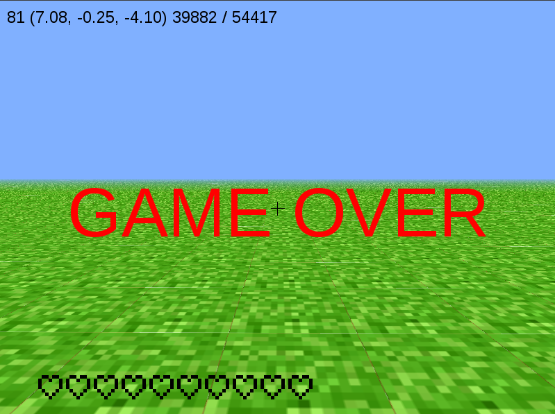

=========
10 Health
=========

Displaying the Health Bar - Part 1
----------------------------------

Now that we can manipulate the world and characters, let's add to our 
player by giving them a health bar.  First, copy the previous exercise 
into a new file as follows (replacing TVR with your initials)::

 	cp 09_mob_TVR.py 10_health_TVR.py

We are going to create a health bar using images of hearts that are filled with
various amounts to indicate Dr. Steve's health.  The files are displayed below.

These are actually three separate image files, but when we line them up like
this, it looks like a single object.  This is how we are going to construct the
health bar. By looking at how much health the player has, we can determine how
filled each heart should be and display the corresponding image in each place
along the line.

First, we need to add some member variables to the window class init function. 
Go to the end of the init function (just before the line with 
``def set_exclusive_mouse``) on line 496, and add the following:

.. literalinclude:: ../code/10_health_part_1.py
	:lines: 496-501

This creates a list of files saved in ``self.health`` which determines which file 
will be displayed for each of the ten hearts.  We then have a variable to hold 
the numerical amount of health the player has and another which we will use later 
to determine if the player has lost health.

Now we need to create some new functions to update the health and draw the health 
bar on the screen.  Find the line reading ``def on_draw(self)`` on line 817 and 
insert the following functions above it:

.. literalinclude:: ../code/10_health_part_1.py
	:pyobject: Window.update_health

.. literalinclude:: ../code/10_health_part_1.py
	:pyobject: Window.draw_health

The first function ``update_health(h)`` updates the value of ``self.health_value`` to 
take on the value of ``h`` and determines which images should be displayed for
each heart.  The second function ``draw_health()`` will be used to actually 
draw the hearts onto the game window.  

One new feature of this code is the use of sprites in `draw_health`.  A sprite 
is an object in the pyglet library that is used to display images in the game
window. Many sprites can share the same source image file, allowing us to 
display ten hearts on the screen while only having three actual image files.  
For more details on usage, please reference the 
`pyglet Programming Guide <https://pyglet.readthedocs.io/en/pyglet-1.2-maintenance/programming_guide/index.html>`_.

Now we need to call the ``draw_health()`` function in our general `on_draw()`
function.  Add a call to ``draw_health()`` in ``on_draw`` so that it reads as 
follows:

.. literalinclude:: ../code/10_health_part_1.py
	:pyobject: Window.on_draw

Now if you run the code, you should see ten hearts displayed at the bottom of 
the screen as below.

Notice that the empty hearts are transparent and you can see the world through 
them.  This is because the original images are stored with .png (portable 
network graphic) file endings. This type of file supports transparency, meaning
we aren't constricted to only displaying images as squares, rather any shape 
you want.

Note that at this point we are only displaying the health bar.  We have not
implemented any ways that the player can lose health.  This will be our next 
step.

You Can Lose Health by Falling- Part 2
--------------------------------------

Let's implement a method that causes you to lose health. One of the most basic ways 
a character can lose health in a game is falling too far and injuring themselves. 
First, go back up to the init function in the window class (the function beginning 
with the line ``def __init__(self, *args, **kwargs):``) on line 496 and change 
the code we just added to the end to read as follows:

.. literalinclude:: ../code/10_health_part_2.py
	:lines: 496-502

We have removed the variable ``prev_health`` and added the variables 
``fell_height`` and ``max_vel``.  These will store whether or not we want to
change the health of Dr. Steve and the maximum velocity reached. ``max_vel`` 
will help us determine how much health should be lost.

Now go to the function we defined as ``update_health()`` and add a new function
called ``check_height`` before it (line 818) as follows:

.. literalinclude:: ../code/10_health_part_2.py
	:pyobject: Window.check_height

This function looks at ``self.dy``, Dr. Steve's vertical velocity and 
determines whether it exceeds a safe range.  If he is falling too fast, we want
to store the maximum magnitude (distance from zero) of the velocity and 
acknowledge that we need to change Dr. Steve's health when they land by 
making ``fell_height`` true.

Now we need to make some changes to the ``draw_health`` function.  Change this 
function to read as follows:

.. literalinclude:: ../code/10_health_part_2.py
	:pyobject: Window.draw_health

Now if you fall a distance of four or more blocks, you will lose health. The
longer you fall the more health you will lose.  

No Health Left: Game Over - Part 3
----------------------------------

Now let's consider what happens if Dr. Steve runs out of health. The game 
should end right?  Let's add a message that occurs when the Dr. Steve runs out
of health that tells the player the game is over. Just after the
``draw_health`` on line 862 function, add the following:

.. literalinclude:: ../code/10_health_part_3.py
	:pyobject: Window.check_game_over

This code says that if ``health_value`` is zero, print the words "GAME OVER" 
to the game play window and eject the mouse from the window. 

Now add a call to the ``check_game_over`` function in ``on_draw()`` so it reads
as follows:

.. literalinclude:: ../code/10_health_part_3.py
	:pyobject: Window.on_draw

Now if you fall too many times the GAME OVER message will be displayed on the 
screen as below and the mouse will be freed from the game play window.  You will
not be able to continue playing unless you close the window and run the program 
again.

Enemies Hurt - Part 4
----------------------

Remember the mob we created in the previous tutorial?  Now we're going to
combine that with the health bar we created in the previous section. Dr. Steve
should lose health when he gets too close to the active mob. First, let's add
some more variables to the ``__init__`` function in the window class.  At the
end of the ``__init__`` function on line 624, after the variables used to 
define the health, add a new variable so the end of the function reads as
follows:

.. literalinclude:: ../code/10_health_part_4.py
	:pyobject: Window.__init__

Now let's create a function that checks if Dr. Steve is too close to an active
mob. For Dr. Steve to lose health, the mob needs to be loaded and close to Dr.
Steve.  We also need to make sure that he doesn't lose health at every 
iteration of the game play loop which is where the new variable 
``count_injure`` is used. Before the ``on_draw`` function at line 1002 in the 
window class, create a new function called ``check_mob_dist`` as follows:

.. literalinclude:: ../code/10_health_part_4.py
	:pyobject: Window.check_mob_dist

Let's walk through the logic behind this function. First, if the mob isn't 
loaded, we don't need to worry about it injuring Dr. Steve. The next checks 
only occur if the mob is loaded. Next, we find the distance in the x and z 
directions between the mob and Dr. Steve. We have defined a distance within 
which Dr. Steve can be hurt, so we check if Dr. Steve is close enough.  If he 
is too close to the mob and hasn't lost health because of the mob in at least 
90 iterations, he should lose two health and update the display on the health 
bar.

Finally, we need to make a call to ``check_mob_dist`` in ``draw_health``.  Make
a call to ``check_mob_dist`` in ``draw_health`` so it reads as follows:

.. literalinclude:: ../code/10_health_part_4.py
	:pyobject: Window.draw_health

Now run the code, notice if you get too close to the mob, you'll now lose 
two health hearts.  Don't forget to load the mob by pressing the ``L`` key.