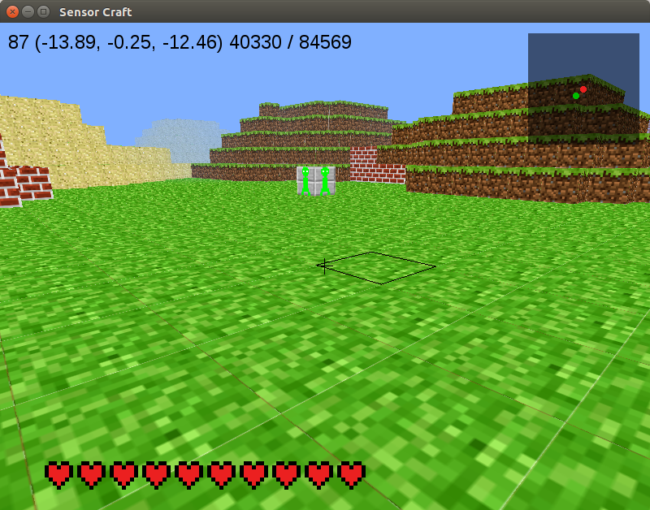

======
12 Map
======

Currently we know our location in the world via the numbers in the top left 
corner of the game play window. Wouldn't it be useful if we had some other 
way of knowing where we are? Where the mob is? Let's add a map to help us 
potentially find or avoid things.

Map and Icon Display - Part 1
------------------------------

Copy the 11_AI_part_2.py code from the previous example (replacing TVR with your
initials) as follows::

	cp 11_AI_part_2.py 12_map_part_1_TVR.py

First, let's create the box for our map and include an icon to represent Dr. 
Steve that will eventually move as the player moves. Go to the end of the 
window class ``__init__`` function and append the following code:

.. literalinclude:: ../code/12_map_part_1.py
	:pyobject: Window.__init__

We are using sprites again like we did when creating the health bar. The following lines of code in the ``__init__`` method create a box to represent 
the world:

.. literalinclude:: ../code/12_map_part_1.py
	:lines: 656-659

The lines of code below in the ``__init__`` method create an icon to represent Dr. Steve. We have to decide where to place the sprite in the window as well as how big it should be.

.. literalinclude:: ../code/12_map_part_1.py
	:lines: 661-664

Next, we need to draw the sprites in the window so that we can see them. Create
a new function ``draw_map`` just before the previously defined ``check_height`` 
function on line 995 as follows:

.. literalinclude:: ../code/12_map_part_1.py
	:pyobject: Window.draw_map

Now call this function in the window ``on_draw`` function so it reads as follows:

.. literalinclude:: ../code/12_map_part_1.py
	:pyobject: Window.on_draw

Execute the code and you should see a slightly transparent black box in 
the upper right hand corner of the screen with a green dot in the middle.

Updating the Map - Part 2
--------------------------

Now we want the map to update as Dr. Steve moves around. To do this, we need to
update the location of the green dot on the screen as Dr. Steve moves. Copy the 12_map_part_1.py code from the previous example (replacing TVR with your
initials) as follows::

	cp 12_map_part_1.py 12_map_part_2_TVR.py

We only need to add two lines of code to the ``draw_map`` function to 
accomplish this. Update the ``draw_map`` function to the following:

.. literalinclude:: ../code/12_map_part_2.py
	:pyobject: Window.draw_map

This updates where on the window the sprite is drawn. It looks at the ratio
between where Dr. Steve is relative to the center of the map and scales this to 
the width and height of the displayed map. Notice there are only x and y 
components for the map because it is a two dimensional object, with these x and y components corresponding to the three dimensional x and z components 
respectively. Now if you run the code again, the green dot will move around the 
screen as you move Dr. Steve.

Mob on the Map - Part 3
------------------------

Let's make the map even more useful by adding one more thing: the location of 
the mob. If you're trying to run away from the mob or chase the mob, it's good 
to know its location, especially when you aren't looking directly at it. First
copy the 12_map_part_2.py code from the previous example (replacing TVR with 
your initials) as follows::

	cp 12_map_part_2.py 12_map_part_3_TVR.py

To add the mob to the map, we are going to follow almost exactly the same 
process as we did to add Dr. Steve to the map. The only difference is that we 
are going to load a different image for the icon so that the mob is represented 
as a red dot.

First, go back to the window ``__init__`` function and add the following at the end on line 666:

.. literalinclude:: ../code/12_map_part_3.py
	:lines: 666-669

This creates the mob sprite for the map. Now go to the ``draw_map`` function and
update it to the following:

.. literalinclude:: ../code/12_map_part_3.py
	:pyobject: Window.draw_map

This says that when the mob is active, draw the icon to the screen. When there 
isn't a mob, we have no need for its icon on the map.

Execute the code and activate the mob to either run away or toward Dr. Steve.
Watch your location and the mob's location update on the map!

This could be very useful later on when you are looking for something. Without 
the map, you could wonder aimlessly trying to find it for a long time. The map 
will help you find things right away. For example, what if we made the mob 
spawn to a random location on the map instead of the center (0,0)? How would 
you find the mob without the map?

It's worth noting that when we draw the map, we know the location of 
everything. We know the size of the world and the numerical locations of both
Dr. Steve and the mob. How could we find the mob if we didn't know its location 
to begin with? If we just saw something on the map, how could we identify what 
it is if there are many potential objects it could be? This is a major point of 
research for the air force: locating and identify objects in different types of 
images.