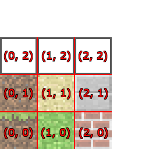

===========
13 Textures
===========

Graphics textures are used heavily in video games and computer visualization
technology.  Let's try and gain a deeper understanding of how textures are 
used in SensorCraft. Copy tutorial 00_flat_world.py to a new file with the
following command, replacing TVR with your initials::

	cp 00_flat_world.py 13_textures_TVR.py

Texture File
------------

Recall the explanation from 
`chapter 02 3D Coordinate System <02_3D_coordinate_system.html>`__ about 
the pyglet library and how three dimensional objects are wrapped with a two 
dimensional image to create different textures and appearances of blocks. To 
define the different textures of blocks, you first need to have a file that 
has the textures for each part of the block. Find the file called 
"custom_texture.png" and open it. You will see some of the textures we used 
before for grass, sand, brick, etc, but we've added three new blocks that 
you can use to make your own textures for the blocks.

Close the image and open it again in an image editor. Windows comes with a 
program called paint, mac has paintbrush, and for Ubuntu Linux systems you 
can open a terminal and run the command ``sudo apt-get install gimp`` to 
install a program called Gimp. The newly added blocks are the three white 
blocks with a black outline. Now you can draw on these three new blocks and 
create a new type of block.

Using the Texture
-----------------

Once the design is too your liking, save the file and close it. Now open 
``13_textures_TVR.py`` and jump down to line 76. This is where we define the
variable ``TEXTURE_PATH``. This tells the program what file contains the 
textures we want to use. We want the variable ``TEXTURE_PATH`` to be set to 
the name of the new file where you created new blocks in the section above.  

.. literalinclude:: ../code/13_textures.py
	:lines: 76

Now we need to define a texture using the new block(s) you designed. To define
a texture, you make a call to ``tex_coords`` to define where in the file to 
look for the textures. Look at the already existing examples just below the 
line defining ``TEXTURE_PATH``.

.. literalinclude:: ../code/13_textures.py
	:lines: 78 - 81

The basic form of a call to ``tex_coords`` is as follows::
	
	TEXTURE_NAME = tex_coords((top), (bottom), (side))

Where ``top``, ``bottom``, and ``side`` are coordinates for in the file for 
what texture should go on the top, bottom, and sides of the block. The grid for
the textures and their coordinates is shown below:

Now you need to define your custom texture. Do this by adding a line below the
previously defined textures and making a call to ``tex_coords`` with the 
correct coordinates in their correct place in the call. For example, if I 
wanted (0,2) to be the top, (1,2) the bottom, and (2,2) for the sides, the 
call would be as follows:

.. literalinclude:: ../code/13_textures.py
	:lines: 83

Building Your Custom Block
--------------------------

Now let's test that your block builds as expected. Find the function called 
``on_mouse_press``. We want to change the call to ``add_block`` in this 
function so that when you click the mouse you build a block with your new
texture. Calls to ``add_block`` take two arguments: position, and texture (in
that order). So we need to change the texture parameter to be your custom 
block. Change line 663 to read as follows:

.. literalinclude:: ../code/13_textures.py
	:lines: 663

Now when you run the code and try to build a block, it will be your custom 
designed block.

