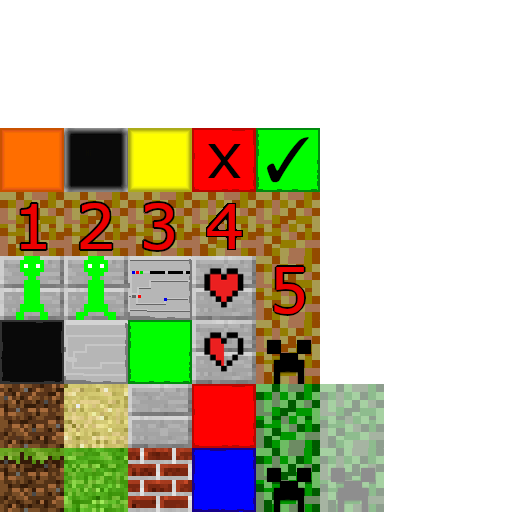
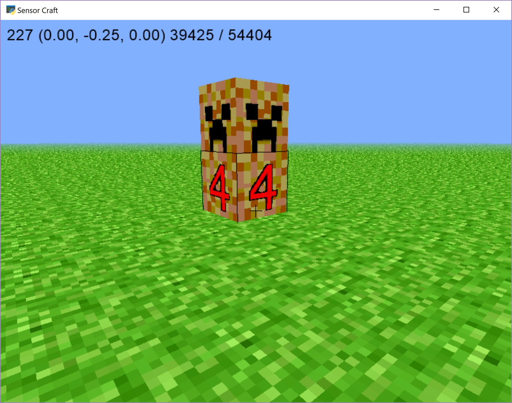

==========
14 Creeper
==========

Using what we learned in the `previous chapter 13 Textures <13_Texture.html>`__
let's create a custom texture to make a Creeper like object that will change
it's apperance.  The Creeper will count down and disapperas when the count
down reaches zero.  Copy tutorial 00_flat_world.py to a new file with the
following command, replacing TVR with your initials::

	cp 00_flat_world.py 14_creeper_part_1_TVR.py

------------
New Textures
------------

First open the file "story_textures.png" and look at all the new textures we've
added to the file. There are some for a basic green creeper that will be two
blocks tall and some for the countdown, where the creeper turns red and 
displays the number of seconds remaining until it disappears.

Make ``TEXTURE_PATH`` point at this file as well by going to approximately line
76 and changing the ``TEXTURE_PATH`` statement to say 
``TEXTURE_PATH = 'story_textures.png'``.

.. literalinclude:: ../code/14_creeper_part_1.py
	:lines: 76

This file is a different size compared to the previous files we've used, so we
need to adjust how we get each texture block to make sure each texture is 
displayed properly. Go line 52 which reads ``def tex_coord(x, y, n=4):`` and 
change it so that ``n`` defaults to 8. The line should read:

.. literalinclude:: ../code/14_creeper_part_1.py
	:lines: 52

Previously we had texture files that were 4 by 4 groups of textures, but 
"story_textures.png" is 8 by 8. ``n`` just represents the dimensions of the 
file and tells the code how many pieces to split the overall image into to get 
each individual texture.

-----------------------------------------
Adding the Creeper to the World - Part 1
-----------------------------------------

First, let's add some variables to keep track of the creeper. Go to the end of
the Model class' ``__init__`` function and just before the call to 
``self._initialize()`` add the following variables:

.. literalinclude:: ../code/14_creeper_part_1.py
	:lines: 165-167

``creeper_time`` will help us track how long the creeper has existed and the 
state of the countdown clock. ``creeper_status`` wil simply state whether or 
not a creeper is in the world. ``creeper_pos`` will store the position where 
the creeper is located.

Next we need to define all the textures needed for the creeper. Go to line 83 
where we defined ``TEXTURE_PATH`` and add the following texture definitions 
below it:

.. literalinclude:: ../code/14_creeper_part_1.py
	:lines: 83-91

Now go down to ``on_mouse_press`` and replace it with the following:

.. literalinclude:: ../code/14_creeper_part_1.py
	:pyobject: Window.on_mouse_press

The two new sections of code are the inner most if statements. Let's walk 
through them a little bit.

The first says ``if self.model.creeper_status``. This block handles if the user 
tries to build another creeper when one is already actively counting down. If 
there already is an active creeper, remove it from the world and set 
``creeper_status`` to false.

The second part then says ``if previous and not self.model.creepre_Status``, so
this section of code only runs if a block is selected and there isn't already 
an active creeper. If both these conditions are met, then we want to add a 
creeper, record the time the creeper was built to start the countdown, and set 
``creeper_status`` to ``True``.

Now if you run the code, you will be able to build a creeper by pressing the 
right mouse button. Notice though that you can only ever have one creeper at a 
time.

----------------------------
Start the Countdown - Part 2
----------------------------

Now let's make the creeper countdown to mark how much longer it will be there.
Copy tutorial 14_creeper_part_1.py to a new file with the following command, 
replacing TVR with your initials::

	cp 14_creeper_part_1.py 14_creeper_part_2_TVR.py

Start with adding a new function that will make the decisions regarding what
type of block the creeper should have. Below the ``on_draw`` function at line
832, add the function below of ``creeper_countdown``.

.. literalinclude:: ../code/14_creeper_part_2.py
	:pyobject: Window.creeper_countdown

This funciton takes the difference between the time of when the creeper was
built and the current time and uses this difference to decide what numbered 
block the body of the creeper should display.

Now go to the ``on_draw`` function and add a call to ``creeper_countdown`` so 
that if ``creeper_status`` is ``True``, this function will be called 
``on_draw`` should then read as below:

.. literalinclude:: ../code/14_creeper_part_2.py
	:pyobject: Window.on_draw

Now you can build a creeper as if you were going to build a regular 
block and watch it turn red and countdown before disappearing.

