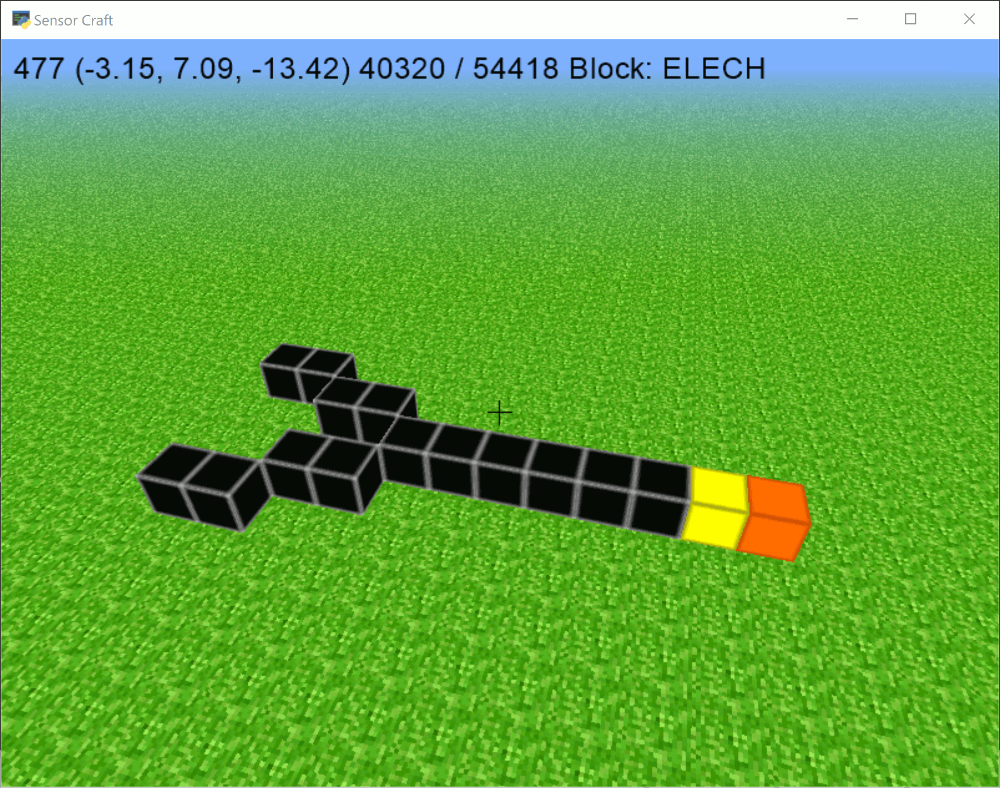

===========
15 Circuits
===========

In this chapter we are going to add some circuit like objects to the game. 
Before we start talking about the code, let's look at the idea behind how this
system will work.

We're going to have three types of new blocks: head, tail, and cable. The tail 
block will always follow the head block and the head block will move to any 
adjacent cable blocks. Be careful though, if you have too many head blocks next
to a cable block it will die out.

------------------------------
Track New Block Types - Part 1
------------------------------

First copy the third tutorial "Show Current Block" to a new file with your 
initials at the end::

	cp 03_show_current_block.py 15_circuits_TVR.py

We need to reference a new texture file with the circuit textures. Go to the 
line reading ``TEXTURE_PATH = 'numbered_textures.png'`` and change it to read
``TEXTURE_PATH = 'story_textures.png'``. Also go to the line reading 
``def tex_coord(x, y, n=4):`` and change it to say ``n=8``. This is because the
new texture file is larger and has more textures in it, so we need to tell the
program how many pieces to break the file into.

Now we need to add the three new block types. The head blocks will be of type 
``ELECH``, the tail blocks will be ``ELECT``, and the cable blocks will simply 
be called ``CABLE``. Delete the numbered stones defined in ``NUMSTONE`` from 
the third tutorial.  Delete the below section of code (around line 80).

.. code-block:: python

	NUMSTONE = []
	NUMSTONE.append(tex_coords((3, 0), (3, 0), (3, 0)))
	NUMSTONE.append(tex_coords((3, 1), (3, 1), (3, 1)))
	NUMSTONE.append(tex_coords((0, 2), (0, 2), (0, 2)))
	NUMSTONE.append(tex_coords((1, 2), (1, 2), (1, 2)))
	NUMSTONE.append(tex_coords((2, 2), (2, 2), (2, 2)))
	NUMSTONE.append(tex_coords((3, 2), (3, 2), (3, 2)))
	NUMSTONE.append(tex_coords((0, 3), (0, 3), (0, 3)))
	NUMSTONE.append(tex_coords((1, 3), (1, 3), (1, 3)))
	NUMSTONE.append(tex_coords((2, 3), (2, 3), (2, 3)))
	NUMSTONE.append(tex_coords((3, 3), (3, 3), (3, 3)))

And then add the below code.

.. literalinclude:: ../code/15_circuits_part_1.py
	:lines: 82-84

After all the above changes are made the code should read as follows from
line 52 to line 85

.. literalinclude:: ../code/15_circuits_part_1.py
	:lines: 52-85

Now go down to the Model class ``__init__`` function and delete 
the below section.

.. code-block:: python

	for i in range(0, 10):
            # x axis
            self.add_block((i, -2, 0), NUMSTONE[i], immediate=False)
            self.add_block((-i, -2, 0), NUMSTONE[i], immediate=False)

            # y axis
            self.add_block((0, -2 + i, 0), NUMSTONE[i], immediate=False)
            self.add_block((0, -2 + -i, 0), NUMSTONE[i], immediate=False)

            # z axis
            self.add_block((0, -2, i), NUMSTONE[i], immediate=False)
            self.add_block((0, -2, -i), NUMSTONE[i], immediate=False)

This removes the numbered axes from the world.

Circuit blocks are going to be special interactive blocks, so let's track them 
separately. We usually track blocks with the ``world`` dictionary which maps 
(x, y, z) positions of blocks to the type/texture of that block. Let's add 
another dictionary called ``circuit`` that acts just like ``world``, but only 
stores circuit blocks.

Just below where ``self.world`` is declared, add a definition for 
``self.circuit``. This section should read as below:

.. literalinclude:: ../code/15_circuits_part_1.py
	:pyobject: Model.__init__

We want to make sure blocks are added to the circuit dictionary only when they 
are circuit related. There are two functions used to add and remove blocks: 
``add_block`` and ``remove_block``. We want to add a section to ``add_block`` 
that says "if the block is a circuit type, add it to ``self.circuit``". 
Similarly we then need to add a statement in ``remove_block`` that says "if the
block is of a circuit type, remove it from ``self.circuit``". Change these two 
functions in the ``Model`` class to read as below.

.. literalinclude:: ../code/15_circuits_part_1.py
	:pyobject: Model.add_block

.. literalinclude:: ../code/15_circuits_part_1.py
	:pyobject: Model.remove_block

Recall how you can press a number key to select which type of block you want to
build. We want to be able to do this with circuit blocks. Go to the line 
reading ``self.inventory = [BRICK, GRASS, SAND]`` (around line number 464) and 
add the three new types of blocks to the list on the right side of the equal sign.
It should then say ``self.inventory = [BRICK, GRASS, SAND, CABLE, ELECH, ELECT]``.

Next go to ``draw_label``. We will need to specify what to display when these 
new types of blocks are selected. We do this by defining the value of 
``blockSelectedString``. Change this function to read as follows.

.. literalinclude:: ../code/15_circuits_part_1.py
	:pyobject: Window.draw_label

Execute the code and now you will be able to add these new types of blocks and 
see what type of block you have selected at the top of the screen.

-------------------------
Run the Circuits - Part 2
-------------------------

In this section we will add the code to make the circuits work.  As is our
customer first copy the circuit tutorial part 1 to a new file with your 
initials at the end::

	cp 15_circuits_part_1.py 15_circuits_part_2_TVR.py

We are going to break this into two parts: identifying what changes need to be
made at each iteration to move the circuit by one block and then actually 
making those changes.

If a cable block is next to two or fewer head blocks, it needs to become a head
block. All head blocks will become tail blocks and all tail blocks will become 
cable. Basically we know what happens to head and tail blocks, but we need to 
search around head blocks. Let's create a function that returns the position of 
all surrounding blocks.

Just after the function ``hit_test`` in the ``Model`` class add the following:

.. literalinclude:: ../code/15_circuits_part_2.py
	:pyobject: Model.neighbor

Basically this function adds and subtracts one from each coordinate and returns 
the position of the specified block and all the surrounding blocks as a list.

Below this, add another function called ``circuit_change``. This function will
actually update the circuit and make it move.

.. literalinclude:: ../code/15_circuits_part_2.py
	:pyobject: Model.circuit_change

This code looks long, but this is just due to the large number of comments 
scattered through the code. Commenting is a important practice in programming
that many people ignore. By commenting your code, it becomes easier for others 
to follow your logic and sometimes it even reminds yourself of what you did and 
why. Let's briefly go through the method ``circuit_change`` together.

The variables ``to_cable``, ``to_elech``, and ``to_elect`` are sets: groups of
values without any duplicates. These are used to store what will happen to the 
contained blocks. For example, blocks in the set ``to_cable`` will become cable
blocks after this function runs.

First we go through all the blocks stored in ``self.circuit``. ``count_h`` 
stores the number of surrounding ELECH blocks for the given position. We need 
to make sure each checked block has a count and we always start at zero. If the
specified block is a tail block, it will become cable. If we find a block of 
type ELECH, we need to check the surrounding blocks, update their ``count_h`` 
value, and if that value is less than or equal to two, that cable block will be
added to ``to_elech`` to become a head block. The checked ELECH block must then 
become a tail block. Finally the three for loops at the end of the function 
make the identified changes.

Now jump down to ``on_key_press`` and add a new ``elif`` case that calls 
``circuit_change`` when the ``C`` key is pressed. That is add the following.

.. code-block:: python

	elif symbol == key.C:
            self.model.circuit_change()

Now if you layout circuit blocks and add a head block followed by a tail block,
you can move the head and tail blocks by pressing ``C`` repeatedly.

