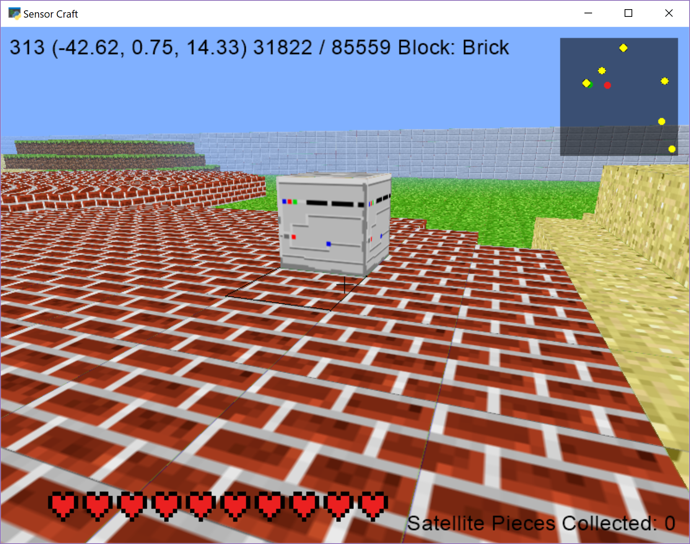
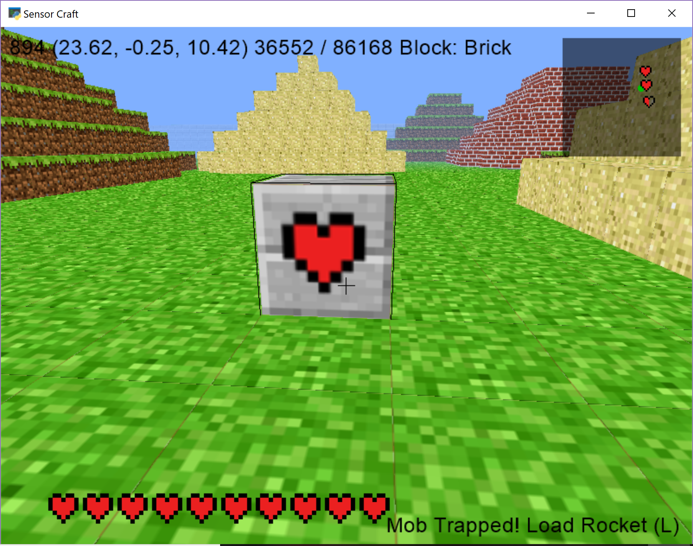
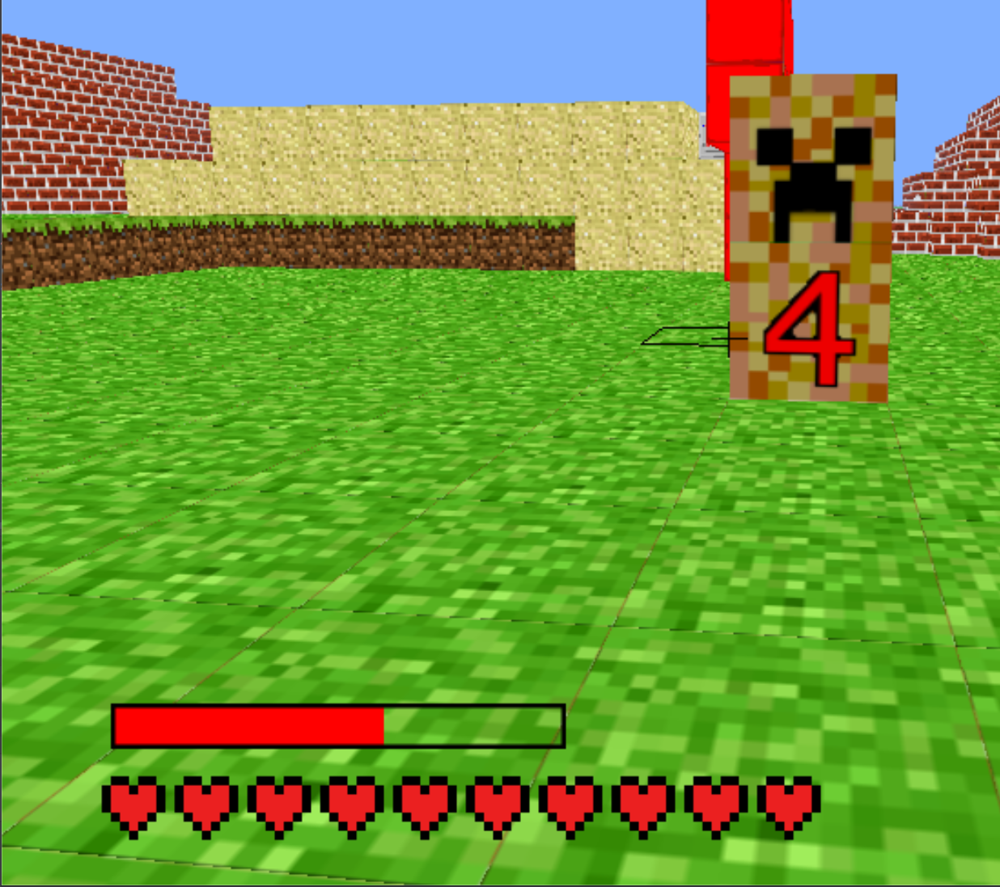
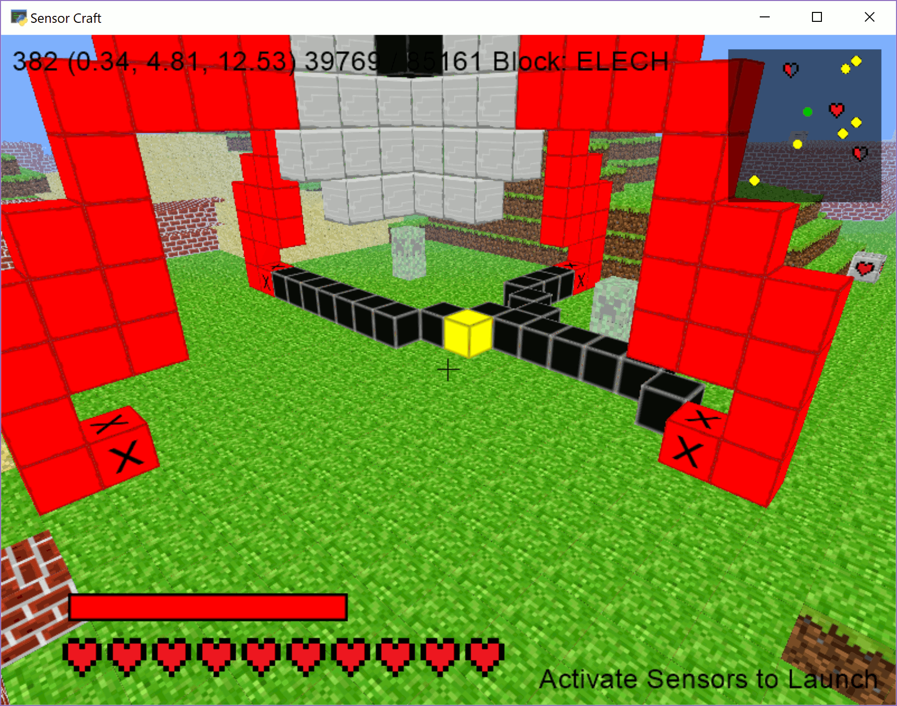

===============================
16 Story Build Launch Satellite
===============================

In this final chapter we will combine many of the previous chapters to provide 
a simple and fun game.  This chapter is meant to provide an example but we
encourage you to use your imagination and create your own game.

You are trying to setup your satellite, but somehow the pieces have been 
scattered everywhere. It's your job to collect them and rebuild your satellite. 
But be careful! There's a mob following you. To assemble your satellite you need 
to collect all the pieces and trap the mob to prevent it from following you back
onto your rocket.

Note you should read through these instructions before you start playing, else 
you may need to start over!

Getting Started
----------------

Copy tutorial 16_story_build_launch.py to a new file with the following command, replacing TVR with your initials::

	cp 16_story_build_launch_sat.py 16_story_build_launch_sat_TVR.py

Run ``16_story_build_launch_sat_TVR.py`` as you would any other code we've seen 
so far. The window will say "PRESS F TO LAUNCH MOB AND BEGIN". When you press 
"F", you will be able to move around the world and the mob will begin chasing 
you. If you look at the map in the top right corner, you will notice the 
familiar dots representing Dr. Steve and the mob, but there will also be yellow
dots representing the six pieces of satellite. You need to collect each of 
these pieces by getting near them. As you collect more pieces, the mob will get 
faster and faster in an attempt to catch you.

Trap the Mob
------------

Once all the pieces of satellite are collected, it's time to trap the mob. 
Remember the chapter 
`01 building automatically <01_building_automatically.html>`__? Now you're 
going to code a box that will trap the mob. The trap should be a six by six box
with the sides reaching three blocks above the current y coordinate of the 
selected block and all the way down to the ground. Before you actually go 
around and collect all the pieces of satellite, read the next section on 
building the trap and fill in the missing pieces of code.

Build the Trap
--------------

The next step requires that you trap the mob in a box. There is partially
completed code provided that you need to fill in with calls to ``add_block``. 
The loop ranges are already provided for you and the coordinates for the
position of the block are given in comments.

Let's say you have the block (2, 5, 0) selected. The box for the trap should 
range between y = -1 (all the way to the ground) and y = 8. It should have 
sides at x = -1, x = 5, z = -3, and z = 3. You can then add a top if you'd 
like. The code for this has been started for you as below, but you need to fill
in the calls to ``add_block`` to actually add the blocks to the world.  Each 
line where you need to call ``add_block`` has a string ``"TODO"`` written on 
it. The below code can be found in the file ``draw_trap_section.py``.

.. literalinclude:: ../code/16_story_build_launch_sat.py
	:pyobject: Window.draw_trap

The loops iterate over the three dimensional cube that the trap will outline. 
Before each call to ``add_block`` that you will place, we need to make sure we 
aren't overwriting any composite blocks as these are part of the rocket. Thus 
we check ``world`` if there is already a block at the given location. If there 
is already a block at a given place, we don't have to worry about adding 
another.If there isn't anything at that location, go ahead and just put a new 
block there.

Finally notice the line ``drew_trap = False``. Change ``drew_trap`` to 
``True`` to acknowledge that you edited the code appropriately.

Once you've written this code, when you have collected all the satellite pieces
you will be able to press "T" to construct the trap centered on the currently 
selected block. If the mob is in the trap, you can move on to the next step. 
Otherwise you have to keep trying!

Go ahead and try running the code and collecting all the pieces. You can then
test the trap and catch the mob. Note that once you have caught the mob, it will
stop moving and can no longer inflict damage on Dr. Steve.  If you get stuck the
file ``draw_trap_answer.py`` contains a working answer simply copy and paste the
code into the draw_trap method in your file 
``16_story_build_launch_sat_TVR.py``.

Gain Some Health
----------------

Once you have trapped the mob health blocks will appear around the world and 
are represented by hearts on the map. These are randomly placed and will either
provide one heart of health or a half heart. To gain health from these blocks, 
simply left click on the block to destroy it and your health will go up. That
block's icon will then disappear off the map.

Notice the message at the bottom right corner of the screen also changes. It 
tells you to push "L" to load the rocket. Be warned though that once the rocket 
is loaded, creepers will appear and attempt to destroy the rocket.

Defending the Rocket
--------------------

Once the rocket is loaded, you will notice a few changes. There is a red bar 
above Dr. Steve's health that represents how much damage has been dealt to the
rocket. If the bar becomes empty, it's game over. You need to defend the rocket 
by preventing the creepers from exploding near it. To stop the creepers, you 
need to neutralize them by pressing "N" when you have one of the creeper's 
blocks selected.

When a creeper gets close to the rocket, it will turn red and start a countdown. 
You can still neutralize a creeper even once the countdown has started. If a 
creeper reaches the end of it's countdown and explodes, the rocket will take 
damage. Dr. Steve needs to watch out too! If a creeper explodes too close to
Dr. Steve he could take damage.

There will be five creepers in total that will randomly spawn around the world. 
There will be no more than three at any given time. They will never spawn under 
the rocket. They will always have to move toward it. They will move at 
different rates, however their countdowns will all be the same. You can watch 
where the creepers are on the map by looking for moving red dots.

A Creeper is neutralized when it is pale and ghostly looking. It can no longer
move or inflict damage.

Launch the Rocket
-----------------

You've defeated the creepers and successfully defended your rocket. Now all 
that's left is to get the satellite into space.

When you neutralize the creepers, you'll notice a red block with an "x" will
appear at each leg of the rocket. These are sensor blocks that can only be
activated by placing a head block (ELECH) near them. The only problem is you 
only have one ELECH block. You need to build a circuit to activate all the
sensors and then launch the rocket. Notice also that if you activate one sensor
and then remove an ELECH block from the world, all the sensors will 
be deactivated. You need to activate them all from one circuit stemming from a
single ELECH block.

In the example below, notice there is only one ELECH yellow block to start with. 
You can only build one, but there can be more than one if you have a split or 
fork in the cable path. Also notice that the rocket does not launch as only 
three of the four sensors are activated.

Once the circuit is completed, Steve will be placed at the top of the rocket 
as it launches into space!