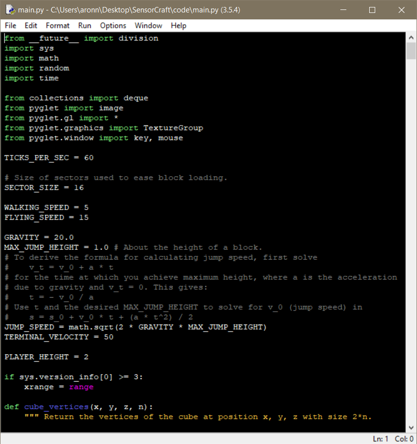

============
Introduction
============

Most people are familiar with Minecraft (Minecraft is developed by Mojang and
not related to this programming tutorial nor do they endorse this tutorial) for
this project we are using a Minecraft type environment created in the Python
programming language. The Air Force Research Laboratory (AFRL) Sensors
Directorate  located in Dayton, Ohio created this guide to inspire kids of all
ages to learn to program and at the same time get an idea of what it is like to
be a Scientist or Engineer for the Air Force. We created this `youtube.com
video about SensorCraft <https://youtu.be/W94dtE1kx7Q>`_

Python is an amazing programming language that is a widely used high-level
programming language.  Python's design philosophy emphasizes code readability
with a code syntax that allows programmers to express concepts in fewer lines of
code than would be possible in other programming languages such as C++ or Java.
See the excellent `wikipedia page on Python
<https://en.wikipedia.org/wiki/Python_(programming_language)>`_  for more
information. To demonstrate the expressive power of Python consider that we can
create a Minecraft game in Python under 900 lines of code.  The game in this
tutorial is not a complete Minecraft clone but it is functional and offers us
the opportunity to explore adding more functions to it.

Python is used everyday at AFRL in all of our technical directorates.  Over the
last 10 years the language has excelled for science and engineering projects
with a emphasis on high performance computing. The Air Force Research Laboratory
is home to some of the `world's  fastest super computers
<http://www.top500.org/site/49284>`_,  with the most recent super computer named
Thunder which has over 125,000 CPU cores capable of computing 5.62 Petaflops and
it runs Python!

This project started with open source code from GitHub here:
https://github.com/fogleman/Minecraft

This code is open source with the original license in the file named LICENSE
take note we are permitted to use it and or modify it.  The original code is in
main.py and the original texture is called "texture.png".  Thank you fogleman
for your effort your project is an amazing foundation to build a STEM project. 
In science it is not unusual to start with somebody else's work. Sir Isaac
Newton is quoted as saying "if I have seen further, it is by standing on the
shoulders of giants". Newton was talking about how science builds upon the base
that has been built before.  We would argue nowhere in the history of man kind
has the shoulders of giants concept been used like it has in software. Software
is easy to  replicate and share.  In Sir Isaac Newton's spirit this guide will
be on github for all to modify, edit, and add to as people see fit. We are not
perfect, hence this guide will have typos and mistakes please submit a
pull request.  If you make a cool programming exercise feel free to
submit that modification via github here:

https://github.com/AFRL-RY/SensorCraft

Install
-------

To make things easier a `YouTube video has been created
<https://www.youtube.com/>`_ to show students how to install SensorCraft and
Python then run the examples.  The video is for Windows but the
process for Mac OS X and Linux is similar.

We are using Python IDLE for this guide. IDLE offers a editor, Python console, 
and debugger in one single package. This editor is great for beginners!  Many 
software development tools exist please use what works best for you in your 
operating system.  We selected IDLE for this project because it ships with 
Python.  

A brief note about Python versions: the Python community has been driving
towards Python 3 since 2008.  Python 2.7 will be at the end of its life in 2020
so we recommend that new Python users start off with Python 3.X.  Over the
last few years their has been increasing support for Python 3.X and 2020
will be here sooner than we think.  When we state Python 3.X we have tested
SensorCraft with Python 3.5 but it should work with Python 3.6 or any 
future 3.X version of Python.

Download and install Python just like any other program on 
your operating system.  

SensorCraft is designed for both Python 2.7 and Python 3.X.  Be careful that when 
you are downloading Python, you pick either 2.7  or 3.X.  
We recommend just downloading the most recent version of Python. To do
this, simply click on the operating system you are using, and then 
click on the download under the 'Download the latest version for 
[your operating system]'

After you install Python like you would install any normal program for your
operating system, start a program called IDLE and you will be presented with a Python shell. See below:

After Python is installed you will need
to get pyglet installed.  Pyglet is a wrapper for OpenGL and abstracts the
complicated graphics programming.  To install pyglet, open a terminal (it will not work on the Python shell) and type this in:

    pip install pyglet

A screen capture below shows how to enter the command into terminal and the
expected results:

An older version of pyglet
might already be installed in which case you need to upgrade with the command::

    pip install pyglet --upgrade

A screen capture below shows the upgrade process and the expected results:

If you get a strange error when running SensorCraft code that states::

    ImportError: cannot import name gl_info

Then you are not using the correct version of pyglet be sure to follow the
upgrade steps above and verify that you have the correct version.

After you have confirmed that the correct version of pyglet is installed, next
you have to download the `latest SensorCraft release zip file
<https://github.com/rovitotv/SensorCraft/releases/latest>`_.  The easiest thing
is to unzip SensorCraft and place in the home directory.  SensorCraft is simply
a bundle of html, py, and texture files.  This guide assumes that SensorCraft is
installed in the home directory with the simple name of SensorCraft please
rename to remove the version number.

Running a SensorCraft Program
-----------------------------

Now that you have all the software installed and are in the correct directory
you are now ready to run the basic SensorCraft program.  The base SensorCraft
program is called main.py within the directory ~/SensorCraft/code. The first
step is to edit the main.py code by opening it in IDLE, the built in Python
editor.
    

After you do this, you will notice that the editor now shows the
main.py code, you can now explore the code by scrolling up and down.  Take
note the base game is less than 900 lines of code.  To start the game click 
on the run menu at the top of your editor and then scroll down to the 'run 
module' option.

after you click run, a window will pop up that looks like this:

To stop a SensorCraft program first you must push the escape key, also
known as esc, the escape key will defocus mouse control from SensorCraft back 
to your desktop. After you have restored mouse control simply close the 
SensorCraft game window like you would any program by clicking the "red x" in
the window corner.

Tips and Tricks on Using IDLE
-----------------------------

The documentation for IDLE is extensive please see 
`Python's IDLE documentation <https://docs.python.org/3/library/idle.html>`_.
On some operating systems the IDLE program is executed by typing ``IDLE3`` at 
the terminal.  To use this guide effectively you will need to know how to use
Find (in the edit menu) and the Go to Line (also in the edit menu) features of 
IDLE.  

Getting Started
---------------

Each separate chapter builds on the previous chapter but they are designed
to stand on their own so feel free to skip around.  The tutorials start with
simple objectives and builds to more difficult objectives. To get started first
copy main.py into a new file name with the copy command like so::

    cp main.py 00_flat_world_TVR.txt

On Microsoft Windows platforms the copy command is spelled out "copy" and for
Linux and OS X the command is "cp".  The example above uses the programmer's
initials on the end of the file. If you get stuck at any point each chapter
has a complete code example that has been tested.    

Example Code
------------

Over the next chapters we dive in with several different fun examples of
extending the SensorCraft game.  Review the examples and try the code, all of 
the exercises have complete answers in the code directory in case you get 
stuck. However, we recommend attempting multiple approaches before using the
included code that ships with this guide. In programming, there's never just 
*one* way to do something, try experimenting. It will help you learn by typing
in the code yourself and trying to figure out how each chapter works. Have fun
and experiment!